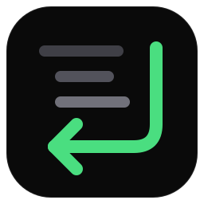

<p align="center">
  
</p>

<h1 align="center">code-mode</h1>

<p align="center">
  <b>Many MCP calls. One program. One small result.</b><br>
  A Claude Code plugin: the model writes one JavaScript program that calls your MCP tools in a sandbox.
  Only the return value goes back into the context.
</p>

<p align="center">
  <a href="LICENSE"></a>
  
  
  <a href="docs/installation.mdx"></a>
  <a href="https://github.com/gabe4coding/claude-code-mode/actions/workflows/test.yml"></a>
</p>

<p align="center">
  <a href="#quick-start">Quick start</a> ·
  <a href="docs/usage.mdx">Usage</a> ·
  <a href="docs/hints.mdx">Hints</a> ·
  <a href="docs/permissions.mdx">Permissions</a> ·
  <a href="docs/configuration.mdx">Config</a>
</p>

---

Without code-mode, the model calls MCP tools one by one, and each full result goes into the context. With
code-mode, the model writes one program. The program calls the tools, then filters and joins the results in a
sandbox. Only the answer goes into the context.

- **Fewer tokens**: the intermediate data stays out of the context. The model uses the context for the task.
- **Sandbox**: the program runs in its own Node process, with no file system and a CPU limit. On macOS, it also
  has no network.
- **Hints**: short notes for each MCP server tell the model about result formats, required arguments and limits.
  The model can propose a new hint, and you approve it.
- **Your permission rules apply**: each MCP call in the program gets the normal permission check.

## Quick start

You need Claude Code and Node.js 22.13 or later.

Type these commands at the prompt of a Claude Code session:

```
/plugin marketplace add gabe4coding/claude-code-mode
/plugin install code-mode@claude-code-mode
```

Start a new session. Then ask for a task that needs several MCP calls.

If you use auto mode, add allow rules for your MCP tools first. Read [Permissions](docs/permissions.mdx).

## Example

You ask: *"Which of my open Jira issues have no update in the last 14 days?"* The model writes one program, for
example:

```js
const issues = await call("mcp__claude_ai_Jira__searchJiraIssuesUsingJql", {
  cloudId: "example.atlassian.net",
  jql: "assignee = currentUser() AND statusCategory != Done",
})
const cutoff = Date.now() - 14 * 24 * 3600 * 1000
return issues.issues
  .filter(i => Date.parse(i.fields.updated) < cutoff)
  .map(i => ({ key: i.key, title: i.fields.summary }))
```

The model gets only the short list, not each full issue.

## Documentation

| Page | |
| --- | --- |
| [Installation](docs/installation.mdx) | Requirements, install, local folder, update |
| [Usage](docs/usage.mdx) | The three tools, how to write a program, the result |
| [Hints](docs/hints.mdx) | Write hints, approve proposals, the safety rules |
| [Permissions](docs/permissions.mdx) | Manual and auto mode, allow rules |
| [Configuration](docs/configuration.mdx) | Every option and its default |
| [How it works](docs/how-it-works.mdx) | One run from start to end, the four sandbox layers |
| [Troubleshooting](docs/troubleshooting.mdx) | Common errors and known limits |
| [Development](docs/development.mdx) | Layout, tests, releases |

## License

MIT. See [LICENSE](LICENSE).
